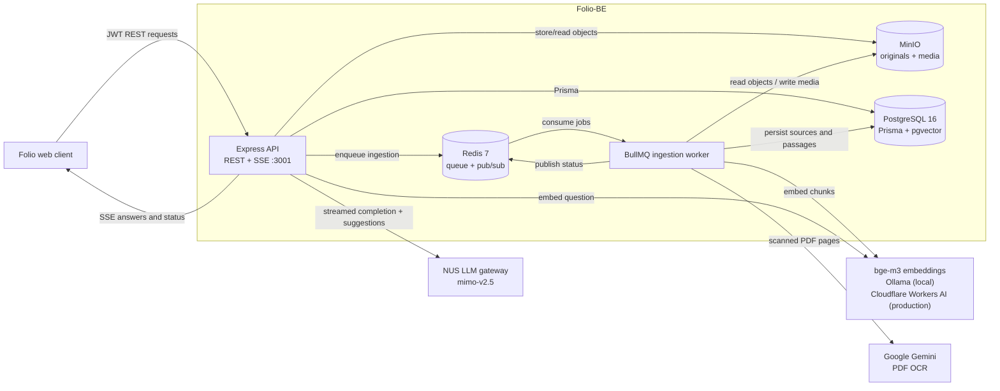
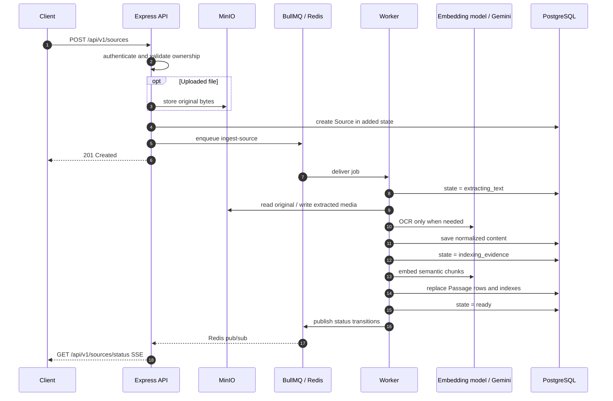
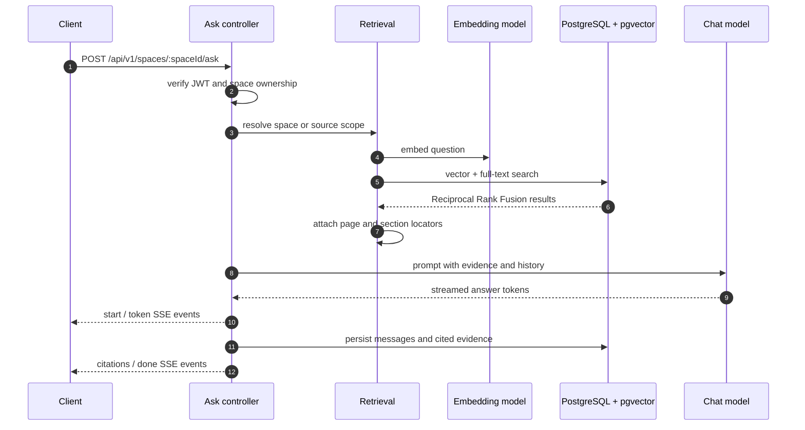
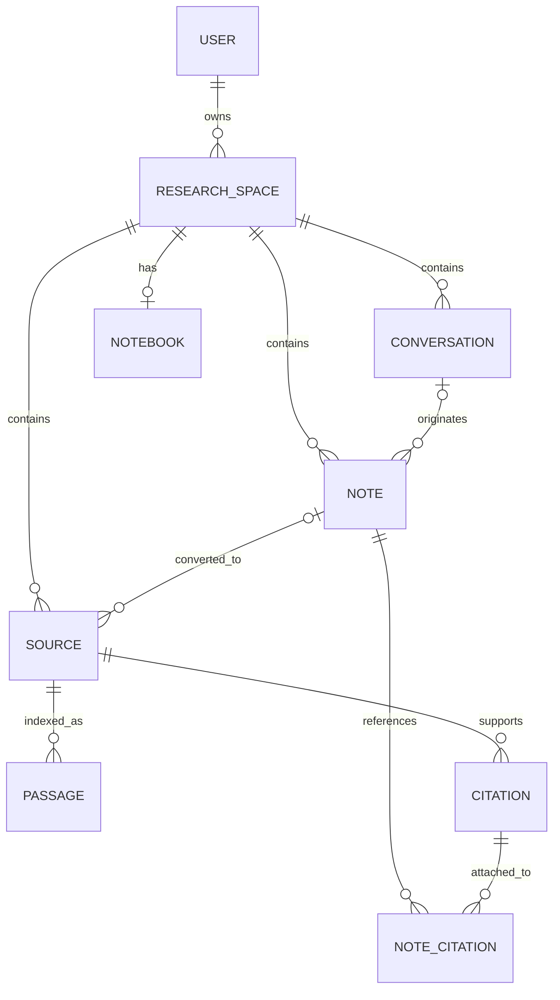

# Folio-BE — Grounded Research API

[](LICENSE)
[](https://nodejs.org/)
[](https://www.typescriptlang.org/)

**Folio-BE** is the backend for Folio, a grounded research notebook by
[NUS Technology](https://www.nustechnology.com/). Users organize work into
research spaces, add files, web pages and notes as evidence, then ask questions
whose streamed answers include citations back to the indexed source passages.

The service combines an Express API with a separate BullMQ ingestion worker.
PostgreSQL stores application data, full-text search indexes and pgvector
embeddings; Redis coordinates background jobs and live status events; MinIO
stores original uploads and extracted media; OpenAI-compatible model endpoints
provide embeddings and answer generation; and Google Gemini reads scanned PDFs.

- **Company:** [NUS Technology](https://www.nustechnology.com/)
- **Repository:** [nustechnology/Folio-BE](https://github.com/nustechnology/Folio-BE)
- **Frontend:** [nustechnology/Folio-Web](https://github.com/nustechnology/Folio-Web)
- **Production:** <https://folio.nustechnology.com> — API at `/api/v1`,
  Swagger UI at `/api-docs`

Everything runs in Docker during development. Ollama is the exception: it
stays on the host because Docker Desktop gives containers no Metal access and
a containerized Ollama is dramatically slower.

## Table of contents

- [Tech stack](#tech-stack)
- [Prerequisites](#prerequisites)
- [Setup](#setup)
- [Daily use](#daily-use)
- [Development commands](#development-commands)
- [Environment configuration](#environment-configuration)
- [System architecture](#system-architecture)
- [Source ingestion flow](#source-ingestion-flow)
- [Grounded-QA flow](#grounded-qa-flow)
- [Data model](#data-model)
- [Main API routes](#main-api-routes)
- [Project conventions](#project-conventions)
- [Logging and observability](#logging-and-observability)
- [Production](#production)
- [License](#license)

---

## Tech stack

| Layer | Technology |
| --- | --- |
| Runtime | Node.js 22.17.1, Yarn 4.12.0 |
| API | Express 4, TypeScript 5.8 |
| Validation | Joi |
| Authentication | JWT access/refresh tokens, bcryptjs |
| Database access | Prisma 7 with `@prisma/adapter-pg` |
| Database | PostgreSQL 16 with pgvector |
| Retrieval | HNSW cosine search + PostgreSQL full-text search, fused with Reciprocal Rank Fusion |
| Background processing | BullMQ with Redis 7 |
| Object storage | MinIO through the S3-compatible AWS SDK |
| Document processing | pdfjs-dist, pdf-lib, Mammoth, JSZip, Marked, Mozilla Readability, JSDOM |
| Supported uploads | PDF, DOCX, TXT, Markdown, PPTX, XLSX, CSV, EPUB |
| Answer generation | OpenAI-compatible chat API — `mimo-v2.5` on the NUS LLM gateway |
| Embeddings | OpenAI-compatible embedding API — `bge-m3` everywhere: local Ollama, production Cloudflare Workers AI `@cf/baai/bge-m3` |
| OCR | Google Gemini `gemini-3.6-flash` |
| Streaming | Server-Sent Events for answers and ingestion status |
| API documentation | OpenAPI 3.0 + Swagger UI |
| Logging | Winston + request-scoped `AsyncLocalStorage` |
| Testing | Vitest |
| Packaging | Multi-stage Dockerfile + Docker Compose |

---

## Prerequisites

The reference development environment is macOS on Apple Silicon:

| Tool | Version | Install |
| --- | --- | --- |
| Docker Desktop | 29.x, Compose v5 | [docker.com](https://www.docker.com/products/docker-desktop/) |
| Ollama | 0.32.x | `brew install ollama` |
| Node.js | 22.17.1 (`.nvmrc`) | `nvm install 22.17.1` |
| Yarn | 4.12.0 (Berry) | `corepack enable && corepack prepare yarn@4.12.0 --activate` |

Node and Yarn are only so your editor can resolve types — the app itself always
runs in a container.

---

## Setup

### 1. Clone and install

```bash
git clone git@github.com:nustechnology/Folio-BE.git
cd Folio-BE
nvm use
yarn install
```

`yarn install` is for your editor's TypeScript server; the container installs
its own dependencies.

### 2. Start Ollama and pull the embedding model

```bash
brew services start ollama
ollama pull bge-m3
ollama list                    # bge-m3 must appear
```

`Passage.embedding` is `vector(1024)` and the API refuses to start if
`MODEL_EMBEDDING_DIMENSIONS` disagrees with that column. Changing the embedding
model needs a full re-index — vectors from different models are not
comparable — and a model of another width also needs a migration on the column.

Answer generation does not use Ollama; it goes to a hosted endpoint, next.

### 3. Get the two API keys

| Variable | Where to get it |
| --- | --- |
| `MODEL_CHAT_API_KEY` | Your personal API key from **[llm.nustechnology.com](https://llm.nustechnology.com)** — sign in and create one under your account. Serves `mimo-v2.5`, which generates the answers. |
| `GEMINI_API_KEY` | Your personal Google Gemini API key from **[aistudio.google.com/apikey](https://aistudio.google.com/apikey)**. Used for OCR on scanned PDF pages, via `gemini-3.6-flash`. |

Both are personal keys — do not share one between developers, and never commit
them.

### 4. Configure the environment

```bash
cp .env.example .env
```

Fill in the `REQUIRED` block at the top. Everything below it already has a
working default:

```bash
COMPOSE_FILE=docker-compose.dev.yml

POSTGRES_USER=postgres
POSTGRES_PASSWORD=postgres
POSTGRES_DB=folio-db

# openssl rand -hex 64
JWT_TOKEN_SECRET=
REFRESH_TOKEN_SECRET=

# Set both base URLs to the same value.
MODEL_CHAT_BASE_URL=https://llm.nustechnology.com/v1
MODEL_CHAT_BASE_URL_DOCKER=https://llm.nustechnology.com/v1
MODEL_CHAT_API_KEY=<your llm.nustechnology.com key>
MODEL_CHAT_MODEL=mimo-v2.5

GEMINI_API_KEY=<your Gemini key>
SEED_USER_PASSWORD=password123
```

`MODEL_CHAT_BASE_URL_DOCKER` is what containers actually use — Compose
overrides `MODEL_CHAT_BASE_URL` with it, and its fallback is host Ollama. Set
both to the same value or Ask will send completions to Ollama, which does not
serve `mimo-v2.5`.

Never put a `#` comment on the same line as a value. Compose reads this file
too, and for an empty key it takes the trailing comment as the value.

### 5. Build and start

```bash
docker compose up -d --build
docker compose ps          # api, worker, db, redis, minio
```

Every `docker compose` command below is bare because `.env` sets
`COMPOSE_FILE=docker-compose.dev.yml`. The repo ships no plain
`docker-compose.yml`, so if that line is missing Compose answers "no
configuration file provided" rather than guessing an environment. Pass
`-f docker-compose.dev.yml` explicitly if you would rather not set it.

### 6. Apply migrations

Migrations are not applied on boot.

```bash
docker compose exec api yarn db:migrate
```

Ends with `Your database is now in sync with your schema.`

### 7. Seed demo data (optional)

```bash
docker compose exec api yarn db:seed        # six spaces
docker compose exec api yarn db:seed:ask    # four sources, then Ctrl-C
```

`db:seed:ask` queues four sources for the worker to extract, chunk and embed —
a minute or two on first run. It holds the Redis connection open after
finishing, so press Ctrl-C once the sources are listed. Confirm with:

```bash
docker compose logs worker | grep -c 'Ingestion job fully completed'   # 4
```

### 8. Verify

```bash
curl localhost:3001/health
open http://localhost:3001/api-docs
```

---

## Daily use

```bash
docker compose up -d          # start
docker compose logs -f api worker
docker compose restart api
docker compose down           # stop, keep data
```

`src/` is bind-mounted, so edits on the host restart `tsx watch` in the
container. Changing `package.json` needs `docker compose up -d --build`.

Start over from an empty database:

```bash
docker compose down -v
docker compose up -d
docker compose exec api yarn db:migrate
```

### What is running

| Service | Address | Purpose |
| --- | --- | --- |
| `api` | `localhost:3001` | HTTP API, Swagger UI at `/api-docs` |
| `worker` | — | Consumes the BullMQ `ingestion` queue |
| `db` | `localhost:5433` | `pgvector/pgvector:pg16` |
| `redis` | `localhost:6379` | Queue backend |
| `minio` | `localhost:9000`, console `:9001` | Uploaded files and extracted media |

Host ports come from `POSTGRES_PORT`, `REDIS_PORT`, `MINIO_API_PORT` and
`MINIO_CONSOLE_PORT` in `.env`.

---

## Development commands

All run inside the `api` container — `docker compose exec api yarn <command>`:

| Command | Purpose |
| --- | --- |
| `db:migrate` | `prisma migrate dev` — apply migrations, create one when the schema changed |
| `db:migrate-prod` | `prisma migrate deploy` — committed migrations only, used in deployment |
| `db:generate` | Regenerate Prisma Client into `src/generated/prisma` |
| `db:seed` | Seed spaces |
| `db:seed:ask` | Seed ingested sources with embeddings |
| `reingest` | Re-index every source against the current embedding model (`--help` for filters, `--reextract`, `--dry-run`). Runs through `tsx`, so development only |
| `reingest:prod` | The same script from `dist/` — the production image carries neither `tsx` nor `src/` |
| `test` | Vitest, single run |
| `typecheck` | `tsc --noEmit`, tests included |
| `lint` | ESLint on `src/**/*.ts`, autofix |
| `build` | Compile to `dist/` |

There is no CI — before pushing:

```bash
docker compose exec api sh -c "yarn lint && yarn typecheck && yarn test"
```

---

## Environment configuration

`.env.example` is the reference for local development: a short `REQUIRED`
block, then every optional key with its default noted above it. Defaults live
in `src/config/enviroment.ts`. The production `.env` is described under
[Production](#production).

| Variable | Note |
| --- | --- |
| `CORS_ORIGIN` | Blank in development means `http://localhost:3000` plus any HTTPS ngrok/Cloudflare tunnel origin. Required in production — the API refuses to start without it |
| `MODEL_EMBEDDING_RPM` | Texts per minute, not HTTP calls. `0` disables the throttle, which is what the local model wants |
| `MODEL_EMBEDDING_SEND_DIMENSIONS` | `true` asks the provider for `MODEL_EMBEDDING_DIMENSIONS` instead of its native width. Only for models wider than the column; `bge-m3` is natively 1024, so leave it off for Ollama and Cloudflare |
| `DATABASE_URL` | Overridden inside Compose to the `db` hostname; only read by the Prisma CLI outside it |
| `MINIO_*`, `REDIS_*` | Compose points these at its own services; the defaults already agree |

---

## System architecture



Both embedding arrows use the same OpenAI-compatible `MODEL_EMBEDDING_*`
endpoint.

The synchronous API follows a layered request path:

```text
HTTP request
    |
    v
Express router          validate with Joi, authenticate, rate-limit
    |
    v
Controller              translate HTTP input/output
    |
    v
Service                 application logic
    |
    v
Repository              Prisma queries, strip sensitive fields
    |
    v
PostgreSQL + pgvector
```

### Directory structure

```text
.
├── prisma.config.ts              # Prisma 7 CLI config (defineConfig)
├── src
│   ├── index.ts                  # entry point: ensureBucket(), HTTP listener
│   ├── api
│   │   ├── index.ts              # Express app, global middleware, Swagger mount
│   │   ├── docs                  # OpenAPI specification
│   │   ├── routes                # route definitions + Joi validators
│   │   ├── controllers           # HTTP input/output orchestration
│   │   ├── services              # business logic, ingestion pipeline, ask/retrieval
│   │   ├── errors                # application errors and the ErrorCode set
│   │   ├── middlewares           # auth, validation, rate limit, upload, logging, errors
│   │   ├── types                 # per-domain option and payload types
│   │   └── utils                 # MinIO, files, HTML/text, tokens, embeddings
│   ├── config                    # enviroment.ts (sic), logger, cors, redis, minio, request-context
│   ├── queues                    # ingestion.queue.ts
│   ├── workers                   # ingestion.worker.ts — the worker container's entry point
│   ├── scripts                   # reingest-sources.ts
│   ├── prisma
│   │   ├── schema.prisma
│   │   ├── migrations            # committed; production runs migrate deploy
│   │   ├── repositories          # database access
│   │   └── seeds
│   └── generated/prisma          # build artifact — never edit
├── Dockerfile                    # every environment — stages: deps, dev, builder, runner
├── docker-compose.dev.yml        # local stack: api, worker, db, redis, minio
└── docker-compose.prod.yml       # VPS stack: backend, worker, migrate, db, redis
```

---

## Source ingestion flow

Sources may be uploaded files, web pages or manually entered text. File
uploads are limited to 50 MiB and may be PDF, DOCX, TXT, Markdown, PPTX, XLSX,
CSV or EPUB.



The worker executes:

```text
extract → normalize → semantic chunk → embed → index
```

For byte-identical files, ingestion can reuse extraction output from another
ready source owned by the same user. `yarn reingest --reextract` forces parsing
again. Spreadsheet sources skip the semantic breakpoint pass, since their rows
are already atomic. Reader HTML is sanitized before storage; images extracted
from DOCX and EPUB files are stored under `sources/<sourceId>/media/` in MinIO
rather than inlined as data URIs.

---

## Grounded-QA flow



Only sources in the `ready` state are searchable. Retrieval embeds the
question once, combines HNSW cosine similarity with PostgreSQL `tsvector`
ranking, and fuses both lists with Reciprocal Rank Fusion. The prompt contains
the retrieved evidence, limited conversation history, research objective and
active scope.

The controller owns the SSE transport. It streams named `start`, `token`,
`citations`, `done` and `error` events, while the service persists the
conversation and durable citation snapshots. When retrieval finds no evidence,
the service returns a bounded no-evidence response rather than asking the
model to answer from general knowledge.

---

## Data model



| Model | Responsibility |
| --- | --- |
| `User` | Account credentials, refresh token and token-revocation version |
| `ResearchSpace` | User-owned research objective and content boundary |
| `Source` | File, web or manual evidence plus extraction state and reader content |
| `Passage` | Semantic chunk, `vector(1024)` embedding, generated `tsvector` and locator |
| `Conversation` | Ask history and active retrieval scope |
| `Citation` | Durable snapshot of evidence used by an answer |
| `Note` | User-authored or saved-answer working material |
| `NoteCitation` | Ordered many-to-many link between a note and its citations |
| `Notebook` | One auto-saved long-form document per research space |

`Passage.embedding` uses an HNSW cosine index.
`Passage.searchVector` is a generated PostgreSQL `tsvector` with a GIN index.
Committed migrations contain the raw SQL Prisma cannot fully express.

---

## Main API routes

Base URL `http://localhost:3001/api/v1` locally,
`https://folio.nustechnology.com/api/v1` in production. See `/api-docs` for the
full surface with schemas and interactive examples — log in, select
**Authorize** and paste the access token; Swagger adds the `Bearer` prefix
itself. The raw OpenAPI document is at `/api-docs.json`.

| Path | Purpose |
| --- | --- |
| `/auth` | `sign-up`, `login`, `refresh`, `logout` |
| `/users` | Get a user by ID (UUID) or `me`; update the authenticated profile |
| `/spaces` | Spaces, and nested under `/:spaceId`: notes, notebook, `ask`, conversations |
| `/sources` | Upload/create, list, get, update, delete, retry, `status` SSE, preview link, original file, extracted media |
| `/passages` | Passage lookup behind citations |
| `/health` | Service health and timestamp (unauthenticated) |

Login returns a short-lived access token (`ACCESS_TOKEN_EXPIRATION`, 15m by
default) and a refresh token (`REFRESH_TOKEN_EXPIRATION`, 30d). Send the access
token as `Authorization: Bearer <token>`; exchange the refresh token at
`POST /auth/refresh`.

Two `/sources` routes are deliberately outside `auth`, because a browser tab
or an `` sends no bearer header. `GET /sources/:sourceId/file?token=…`
streams the stored original; the token is a 5-minute JWT pinned to that one
source, minted by the authenticated `GET /sources/:sourceId/preview`.
`GET /sources/:sourceId/media/:fileName` serves images extracted from DOCX and
EPUB, gated on knowing the source UUID and content hash.

Responses use `{ "status": "success", "data": {} }` or
`{ "status": "error", "message": "...", "code": "SOURCE_NOT_READY" }`. `code`
comes from the closed `ErrorCode` set in `src/api/errors/error-codes.ts`, so
clients can branch on it instead of on the message text.

---

## Project conventions

Adding a feature, in order:

1. Update `src/prisma/schema.prisma`.
2. `docker compose exec api yarn prisma migrate dev --name describe_change`,
   then `docker compose exec api yarn db:generate`.
3. Database queries → a repository in `src/prisma/repositories`.
4. Application logic → a service in `src/api/services`.
5. HTTP orchestration → a controller in `src/api/controllers`.
6. Validation and middleware composition → a router.
7. Mount it in `src/api/routes/index.ts`.

Conventions:

- **CommonJS** — no `"type": "module"`; `tsc` emits `require()`/`exports`.
- **Path alias `~/*` → `src/*`.** All source imports use it; no relative
  imports outside generated code. `tsc-alias` rewrites them in `dist/`.
- Routers stay thin and HTTP-focused; services hold no raw database queries;
  repositories decide no status codes and send no responses.
- Validate untrusted input before the controller. Authenticated routes sit
  behind `auth`.
- Never return password hashes or put them in JWT payloads.
- Tests are colocated as `src/**/*.test.ts` so lint and typecheck cover them;
  `tsconfig.build.json` keeps them out of `dist/`.
- Prettier: 80 columns, single quotes, no trailing commas.
- Treat `src/generated/prisma` as a build artifact — change the schema and
  regenerate.
- Commit migration directories; never run `migrate dev` against production.

`Passage` carries two things Prisma cannot express natively: `searchVector` is a
Postgres `GENERATED ALWAYS` column, and its two indexes are HNSW and GIN. Both
are declared in the schema anyway — as a `dbgenerated()` default and as plain
`@@index` entries — so that `migrate dev` sees no drift. Leave them in place.

---

## Logging and observability

Winston, structured, with request context carried across async handlers by
`AsyncLocalStorage`.

- Development logs are colorized and human-readable; production logs are JSON.
- Every request gets an `x-request-id` response header. An incoming one is
  reused when it is ≤128 characters, otherwise a UUID is generated.
- Completed-request logs include method, path, status, duration, request ID and
  the authenticated user ID when known.
- Error middleware logs the full stack once: expected `4xx` at `warn`,
  unexpected `5xx` at `error`. Production responses expose no stack traces.

Set the floor with `LOG_LEVEL` (`error`, `warn`, `info`, `http`, `debug`).

Never log passwords, tokens, authorization headers, secrets, full database
URLs, or sensitive request bodies.

---

## Production

Folio runs at <https://folio.nustechnology.com> on the shared NUS Technology
VPS, as two Compose projects: `folio` from this repo and `folio-web` from
[Folio-Web](https://github.com/nustechnology/Folio-Web). They meet only on the
external `shared-network`.

### Topology

```text
Browser ──https──► Cloudflare            TLS terminates here; an Origin Rule
                      │                  sends the subdomain to VPS port 3000
                      ▼
                 shared-nginx :3000
                      ├── /            → folio-frontend:3000   (Folio-Web)
                      ├── /api/        → folio-backend:3001
                      └── /api-docs    → folio-backend:3001
```

| Container | Image | Networks | Role |
| --- | --- | --- | --- |
| `folio-backend` | `runner` stage | `shared-network`, `folio-internal` | Express API on `:3001` |
| `folio-worker` | `runner` stage | `shared-network`, `folio-internal` | Ingestion worker, same image, different command |
| `folio-migrate` | `builder` stage | `folio-internal` | One-shot `yarn db:migrate-prod`; `Exited (0)` is success |
| `folio-db` | `pgvector/pgvector:pg16` | `folio-internal` | Folio's own Postgres |
| `folio-redis` | `redis:7-alpine` | `folio-internal` | Queue and pub/sub, append-only |
| `shared-minio` | shared | `shared-network` | Bucket `folio-sources`, accessed by the scoped user `folio-app` |

No Folio container publishes a host port. Postgres and Redis sit only on
`folio-internal`, so nothing else on the box can reach them. `folio-backend`
and `folio-worker` also join `shared-network`, because that is where Nginx and
`shared-minio` live.

### Models in production

| Job | Provider | Model | Configured by |
| --- | --- | --- | --- |
| Answers and starter questions | NUS LLM gateway, `https://llm.nustechnology.com/v1` | `mimo-v2.5` | `MODEL_CHAT_*` |
| Embeddings | Cloudflare Workers AI, OpenAI-compatible `https://api.cloudflare.com/client/v4/accounts/<account-id>/ai/v1` | `@cf/baai/bge-m3`, natively 1024 dimensions | `MODEL_EMBEDDING_*` |
| OCR for scanned and table pages | Google Gemini `generateContent` | `gemini-3.6-flash` | `GEMINI_API_KEY` |

Production embeds with the same model as local development — `bge-m3` at
1024 dimensions, matching `Passage.embedding` — so `MODEL_EMBEDDING_SEND_DIMENSIONS`
stays off. It is hosted rather than local because the VPS CPU exposes no AVX,
which makes an Ollama `bge-m3` there far too slow. `MODEL_EMBEDDING_API_KEY`
is a Cloudflare API token with Workers AI access. The gateway pins
`encoding_format: 'float'`, because Workers AI answers with plain number
arrays.

Set the chat variables explicitly — left blank they fall back to the embedding
host, which serves no chat model.

### Server layout and `.env`

```text
/home/nus/srv/folio/
├── Folio-BE/        # this repo; .env beside docker-compose.prod.yml
├── Folio-Web/       # the frontend repo; .env holds only COMPOSE_FILE
└── data/            # postgres/, redis/, backend-tmp/ — outside both clones
```

The production `.env` (`chmod 600`, never committed) sets
`COMPOSE_FILE=docker-compose.prod.yml`, `FOLIO_DATA_DIR=/home/nus/srv/folio/data`,
`FOLIO_DOMAIN` (which becomes `CORS_ORIGIN`), the `FOLIO_DB_*` credentials,
Folio's scoped MinIO key as `MINIO_ROOT_USER` / `MINIO_ROOT_PASSWORD`, both
token secrets, and the model keys above.

Do not put `PORT` in it. The image sets `PORT=3001`, which is where Nginx
proxies, and `env_file` outranks a Dockerfile `ENV`.

### Deploy

```bash
cd /home/nus/srv/folio/Folio-BE
git pull
docker compose up -d --build
docker compose ps -a          # folio-migrate "Exited (0)" means migrations applied
```

`COMPOSE_FILE` in `.env` makes bare `docker compose` commands target the
production stack. The repo ships no plain `docker-compose.yml`, so a bare
command can never start the development stack by mistake. On every deploy,
`folio-migrate` applies committed migrations from the `builder` stage, and
`folio-backend` and `folio-worker` wait for it to finish. A frontend change is
deployed the same way from `Folio-Web` and never restarts the API.

### Operations

```bash
docker compose logs -f folio-backend folio-worker
docker compose restart folio-backend folio-worker

# Re-index against the configured embedding model. --dry-run lists what would
# change and checks the configured width against Passage.embedding first.
docker compose exec folio-backend node dist/scripts/reingest-sources.js --dry-run
```

Call `node` directly rather than `yarn reingest:prod`: inside the non-root
container, `yarn` resolves through Corepack and prompts to download a second
Yarn.

State lives in three places: Postgres and Redis under `FOLIO_DATA_DIR`, uploads
and extracted media in the `folio-sources` bucket on the shared MinIO, and
secrets only in `.env`. Back up all three.

### Public Swagger

Swagger is served unconditionally, and in production it is public at
<https://folio.nustechnology.com/api-docs>. The OpenAPI document declares its
server as `/`, so **Try it out** sends requests to the production API — they
run against **live production data**, not a sandbox. Anyone who can reach the
domain can read the whole API surface; only the bearer token stops them
calling the authenticated half of it.

Deployment secrets and server access: **contact SamHT.**

---

## License

This project is licensed under the
[NUS Technology Non-Commercial License 1.0](LICENSE).

Use, copying and modification are permitted only for personal, educational,
research and non-commercial demonstration purposes. Commercial use and
redistribution are not permitted. For commercial licensing, contact
[NUS Technology](https://www.nustechnology.com/).
