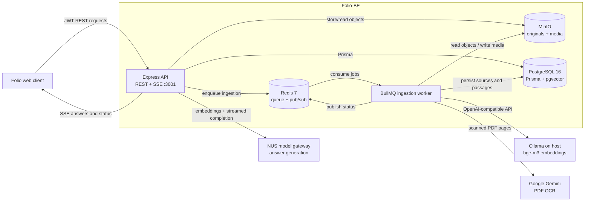
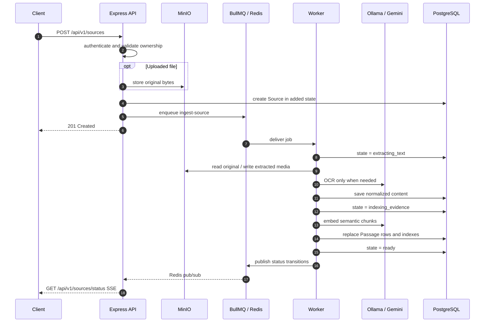
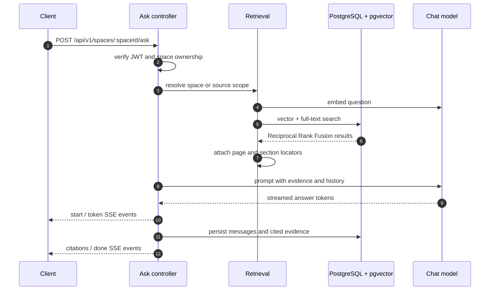
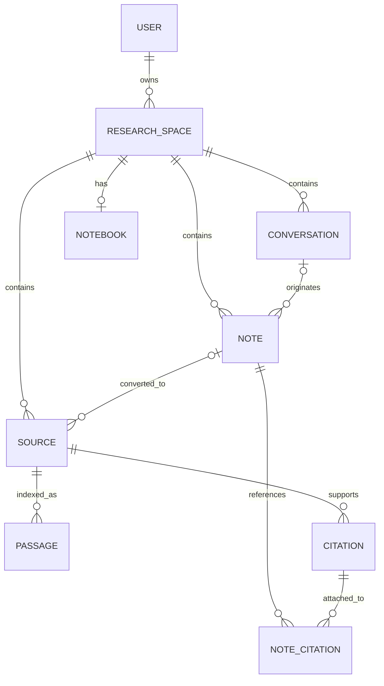

# Folio-BE — Grounded Research API

[](LICENSE)
[](https://nodejs.org/)
[](https://www.typescriptlang.org/)

**Folio-BE** is the backend for Folio, a grounded research notebook by
[NUS Technology](https://www.nustechnology.com/). Users organize work into
research spaces, add files, web pages and notes as evidence, then ask questions
whose streamed answers include citations back to the indexed source passages.

The service combines an Express API with a separate BullMQ ingestion worker.
PostgreSQL stores application data, full-text search indexes and pgvector
embeddings; Redis coordinates background jobs and live status events; MinIO
stores original uploads and extracted media; and OpenAI-compatible model
endpoints provide embeddings and answer generation.

- **Company:** [NUS Technology](https://www.nustechnology.com/)
- **Repository:** [nustechnology/Folio-BE](https://github.com/nustechnology/Folio-BE)

Everything runs in Docker during development. Ollama is the exception: it
stays on the host because Docker Desktop gives containers no Metal access and
a containerized Ollama is dramatically slower.

## Table of contents

- [Tech stack](#tech-stack)
- [Prerequisites](#prerequisites)
- [Setup](#setup)
- [Daily use](#daily-use)
- [Development commands](#development-commands)
- [Environment configuration](#environment-configuration)
- [System architecture](#system-architecture)
- [Source ingestion flow](#source-ingestion-flow)
- [Grounded-QA flow](#grounded-qa-flow)
- [Data model](#data-model)
- [Main API routes](#main-api-routes)
- [Project conventions](#project-conventions)
- [Logging and observability](#logging-and-observability)
- [Deployment](#deployment)
- [License](#license)

---

## Tech stack

| Layer | Technology |
| --- | --- |
| Runtime | Node.js 22.17.1, Yarn 4.12.0 |
| API | Express 4, TypeScript 5.8 |
| Validation | Joi |
| Authentication | JWT access/refresh tokens, bcryptjs |
| Database access | Prisma 7 with `@prisma/adapter-pg` |
| Database | PostgreSQL 16 with pgvector |
| Retrieval | HNSW cosine search + PostgreSQL full-text search, fused with Reciprocal Rank Fusion |
| Background processing | BullMQ with Redis 7 |
| Object storage | MinIO through the S3-compatible AWS SDK |
| Document processing | pdfjs-dist, Mammoth, JSZip, Marked, Mozilla Readability, JSDOM |
| Supported uploads | PDF, DOCX, TXT, Markdown, PPTX, XLSX, CSV, EPUB |
| AI gateways | OpenAI-compatible chat and embedding APIs; Ollama for local `bge-m3` embeddings |
| OCR | Google Gemini |
| Streaming | Server-Sent Events for answers and ingestion status |
| API documentation | OpenAPI 3.0 + Swagger UI |
| Logging | Winston + request-scoped `AsyncLocalStorage` |
| Testing | Vitest |
| Packaging | Multi-stage Dockerfile + Docker Compose |

---

## Prerequisites

The reference development environment is macOS on Apple Silicon:

| Tool | Version | Install |
| --- | --- | --- |
| Docker Desktop | 29.x, Compose v5 | [docker.com](https://www.docker.com/products/docker-desktop/) |
| Ollama | 0.32.x | `brew install ollama` |
| Node.js | 22.17.1 (`.nvmrc`) | `nvm install 22.17.1` |
| Yarn | 4.12.0 (Berry) | `corepack enable && corepack prepare yarn@4.12.0 --activate` |

Node and Yarn are only so your editor can resolve types — the app itself always
runs in a container.

---

## Setup

### 1. Clone and install

```bash
git clone git@github.com:nustechnology/Folio-BE.git
cd Folio-BE
nvm use
yarn install
```

`yarn install` is for your editor's TypeScript server; the container installs
its own dependencies.

### 2. Start Ollama and pull the embedding model

```bash
brew services start ollama
ollama pull bge-m3
ollama list                    # bge-m3 must appear
```

`bge-m3` is not interchangeable. `Passage.embedding` is `vector(1024)` and the
API refuses to start if `MODEL_EMBEDDING_DIMENSIONS` disagrees with that column.
Changing the embedding model needs a migration on the column and a full
re-index — vectors from different models are not comparable.

Answer generation does not use Ollama; it goes to a hosted endpoint, next.

### 3. Get the two API keys

| Variable | Where to get it |
| --- | --- |
| `MODEL_CHAT_API_KEY` | Your personal API key from **[llm.nustechnology.com](https://llm.nustechnology.com)** — sign in and create one under your account. Serves `mimo-v2.5`, which generates the answers. |
| `GEMINI_API_KEY` | Your personal Google Gemini API key from **[aistudio.google.com/apikey](https://aistudio.google.com/apikey)**. Used for OCR on scanned PDF pages, via `gemini-3.6-flash`. |

Both are personal keys — do not share one between developers, and never commit
them.

### 4. Configure the environment

```bash
cp .env.example .env
```

Fill in the `REQUIRED` block at the top. Everything below it already has a
working default:

```bash
POSTGRES_USER=postgres
POSTGRES_PASSWORD=postgres
POSTGRES_DB=folio-db

# openssl rand -hex 64
JWT_TOKEN_SECRET=
REFRESH_TOKEN_SECRET=

# Set both base URLs to the same value.
MODEL_CHAT_BASE_URL=https://llm.nustechnology.com/v1
MODEL_CHAT_BASE_URL_DOCKER=https://llm.nustechnology.com/v1
MODEL_CHAT_API_KEY=<your llm.nustechnology.com key>
MODEL_CHAT_MODEL=mimo-v2.5

GEMINI_API_KEY=<your Gemini key>
SEED_USER_PASSWORD=password123
```

`MODEL_CHAT_BASE_URL_DOCKER` is what containers actually use — Compose
overrides `MODEL_CHAT_BASE_URL` with it, and its fallback is host Ollama. Set
both to the same value or Ask will send completions to Ollama, which does not
serve `mimo-v2.5`.

Never put a `#` comment on the same line as a value. Compose reads this file
too, and for an empty key it takes the trailing comment as the value.

### 5. Build and start

```bash
docker compose up -d --build
docker compose ps          # api, worker, db, redis, minio
```

Every `docker compose` command below is bare because `.env` sets
`COMPOSE_FILE=docker-compose.dev.yml`. The repo ships no plain
`docker-compose.yml`, so if that line is missing Compose answers "no
configuration file provided" rather than guessing an environment. Pass
`-f docker-compose.dev.yml` explicitly if you would rather not set it.

### 6. Apply migrations

Migrations are not applied on boot.

```bash
docker compose exec api yarn db:migrate
```

Ends with `Your database is now in sync with your schema.`

### 7. Seed demo data (optional)

```bash
docker compose exec api yarn db:seed        # six spaces
docker compose exec api yarn db:seed:ask    # four sources, then Ctrl-C
```

`db:seed:ask` queues four sources for the worker to extract, chunk and embed —
a minute or two on first run. It holds the Redis connection open after
finishing, so press Ctrl-C once the sources are listed. Confirm with:

```bash
docker compose logs worker | grep -c 'Ingestion job fully completed'   # 4
```

### 8. Verify

```bash
curl localhost:3001/health
open http://localhost:3001/api-docs
```

---

## Daily use

```bash
docker compose up -d          # start
docker compose logs -f api worker
docker compose restart api
docker compose down           # stop, keep data
```

`src/` is bind-mounted, so edits on the host restart `tsx watch` in the
container. Changing `package.json` needs `docker compose up -d --build`.

Start over from an empty database:

```bash
docker compose down -v
docker compose up -d
docker compose exec api yarn db:migrate
```

### What is running

| Service | Address | Purpose |
| --- | --- | --- |
| `api` | `localhost:3001` | HTTP API, Swagger UI at `/api-docs` |
| `worker` | — | Consumes the BullMQ `ingestion` queue |
| `db` | `localhost:5433` | `pgvector/pgvector:pg16` |
| `redis` | `localhost:6379` | Queue backend |
| `minio` | `localhost:9000`, console `:9001` | Uploaded files and extracted media |

Host ports come from `POSTGRES_PORT`, `REDIS_PORT`, `MINIO_API_PORT` and
`MINIO_CONSOLE_PORT` in `.env`.

---

## Development commands

All run inside the `api` container — `docker compose exec api yarn <command>`:

| Command | Purpose |
| --- | --- |
| `db:migrate` | `prisma migrate dev` — apply migrations, create one when the schema changed |
| `db:migrate-prod` | `prisma migrate deploy` — committed migrations only, used in deployment |
| `db:generate` | Regenerate Prisma Client into `src/generated/prisma` |
| `db:seed` | Seed spaces |
| `db:seed:ask` | Seed ingested sources with embeddings |
| `reingest` | Re-index every source against the current embedding model (`--help` for filters, `--reextract`, `--dry-run`). Runs through `tsx`, so development only |
| `reingest:prod` | The same script from `dist/` — the production image carries neither `tsx` nor `src/` |
| `test` | Vitest, single run |
| `typecheck` | `tsc --noEmit`, tests included |
| `lint` | ESLint on `src/**/*.ts`, autofix |
| `build` | Compile to `dist/` |

Re-indexing on the VPS is the one command that is regularly needed there and
cannot be copied from the table above. The service is `folio-backend`, not
`api`, and `yarn` inside the container resolves through corepack as a non-root
user, which prompts to download a second Yarn — so call node directly:

```bash
docker compose -f docker-compose.prod.yml exec folio-backend \
  node dist/scripts/reingest-sources.js --dry-run
```

`--dry-run` lists what would be re-indexed and touches nothing, but still
checks the configured dimensions against the actual `Passage.embedding` column
first — so it is also the cheapest way to confirm a model swap before
committing to a full pass.

There is no CI — before pushing:

```bash
docker compose exec api sh -c "yarn lint && yarn typecheck && yarn test"
```

---

## Environment configuration

`.env.example` is the reference: a short `REQUIRED` block, then every optional
key with its default noted above it. Defaults live in
`src/config/enviroment.ts`.

| Variable | Note |
| --- | --- |
| `CORS_ORIGIN` | Blank in development means `http://localhost:3000` plus any HTTPS ngrok/Cloudflare tunnel origin. Required in production |
| `MODEL_EMBEDDING_RPM` | Texts per minute, not HTTP calls. `0` disables the throttle, which is what the local model wants |
| `DATABASE_URL` | Overridden inside Compose to the `db` hostname; only read by the Prisma CLI outside it |
| `MINIO_*`, `REDIS_*` | Compose points these at its own services; the defaults already agree |

---

## System architecture



The synchronous API follows a layered request path:

```text
HTTP request
    |
    v
Express router          validate with Joi, authenticate, rate-limit
    |
    v
Controller              translate HTTP input/output
    |
    v
Service                 application logic
    |
    v
Repository              Prisma queries, strip sensitive fields
    |
    v
PostgreSQL + pgvector
```

### Directory structure

```text
.
├── prisma.config.ts              # Prisma 7 CLI config (defineConfig)
├── src
│   ├── index.ts                  # entry point: ensureBucket(), HTTP listener
│   ├── api
│   │   ├── index.ts              # Express app, global middleware, Swagger mount
│   │   ├── docs                  # OpenAPI specification
│   │   ├── routes                # route definitions + Joi validators
│   │   ├── controllers           # HTTP input/output orchestration
│   │   ├── services              # business logic, ingestion pipeline, ask/retrieval
│   │   ├── errors                # application errors carrying HTTP status codes
│   │   ├── middlewares           # auth, validation, rate limit, upload, logging, errors
│   │   └── utils                 # MinIO, files, HTML/text, tokens, embeddings
│   ├── config                    # enviroment.ts (sic), logger, cors, redis, minio, request-context
│   ├── queues                    # ingestion.queue.ts
│   ├── workers                   # ingestion.worker.ts — the worker container's entry point
│   ├── scripts                   # reingest-sources.ts
│   ├── prisma
│   │   ├── schema.prisma
│   │   ├── migrations            # committed; production runs migrate deploy
│   │   ├── repositories          # database access
│   │   └── seeds
│   └── generated/prisma          # build artifact — never edit
├── Dockerfile                    # every environment — stages: deps, dev, builder, runner
├── docker-compose.dev.yml        # local stack: api, worker, db, redis, minio
└── docker-compose.prod.yml       # VPS stack: adds migrate, uses shared MinIO
```

---

## Source ingestion flow

Sources may be uploaded files, web pages or manually entered text. File
uploads are limited to 50 MiB and may be PDF, DOCX, TXT, Markdown, PPTX, XLSX,
CSV or EPUB.



The worker executes:

```text
extract → normalize → semantic chunk → embed → index
```

For byte-identical files, ingestion can reuse extraction output from another
ready source owned by the same user. `yarn reingest --reextract` forces parsing
again. Reader HTML is sanitized before storage; images extracted from DOCX and
EPUB files are stored under `sources/<sourceId>/media/` in MinIO rather than
inlined as data URIs.

---

## Grounded-QA flow



Only sources in the `ready` state are searchable. Retrieval embeds the
question once, combines HNSW cosine similarity with PostgreSQL `tsvector`
ranking, and fuses both lists with Reciprocal Rank Fusion. The prompt contains
the retrieved evidence, limited conversation history, research objective and
active scope.

The controller owns the SSE transport. It streams named `start`, `token`,
`citations`, `done` and `error` events, while the service persists the
conversation and durable citation snapshots. When retrieval finds no evidence,
the service returns a bounded no-evidence response rather than asking the
model to answer from general knowledge.

---

## Data model



| Model | Responsibility |
| --- | --- |
| `User` | Account credentials, refresh token and token-revocation version |
| `ResearchSpace` | User-owned research objective and content boundary |
| `Source` | File, web or manual evidence plus extraction state and reader content |
| `Passage` | Semantic chunk, `vector(1024)` embedding, generated `tsvector` and locator |
| `Conversation` | Ask history and active retrieval scope |
| `Citation` | Durable snapshot of evidence used by an answer |
| `Note` | User-authored or saved-answer working material |
| `NoteCitation` | Ordered many-to-many link between a note and its citations |
| `Notebook` | One auto-saved long-form document per research space |

`Passage.embedding` uses an HNSW cosine index.
`Passage.searchVector` is a generated PostgreSQL `tsvector` with a GIN index.
Committed migrations contain the raw SQL Prisma cannot fully express.

---

## Main API routes

Base URL `http://localhost:3001/api/v1`. See `/api-docs` for the full surface
with schemas and interactive examples — log in, select **Authorize** and paste
the access token; Swagger adds the `Bearer` prefix itself.

Swagger is served unconditionally, in every environment, and on the VPS it is
public at <https://folio.nustechnology.com/api-docs> (spec at
`/api-docs.json`). The OpenAPI document declares its server as `/`, so **Try it
out** fires same-origin requests that Nginx routes to the backend — meaning
requests run against **live production data**, not a sandbox. Anyone who can
reach the domain can read the whole API surface; only the bearer token stops
them calling the authenticated half of it.

| Path | Purpose |
| --- | --- |
| `/auth` | `sign-up`, `login`, `refresh`, `logout` |
| `/users` | Get a user by numeric ID or `me`; update the authenticated profile |
| `/spaces` | Spaces, and nested under `/:spaceId`: notes, `ask`, conversations |
| `/sources` | Upload/create, list, status, retry, delete, serve extracted media |
| `/passages` | Passage lookup behind citations |
| `/health` | Service health and timestamp (unauthenticated) |

Login returns a short-lived access token (`ACCESS_TOKEN_EXPIRATION`, 15m by
default) and a refresh token (`REFRESH_TOKEN_EXPIRATION`, 30d). Send the access
token as `Authorization: Bearer <token>`; exchange the refresh token at
`POST /auth/refresh`.

Responses use `{ "status": "success", "data": {} }` or
`{ "status": "error", "message": "..." }`.

---

## Project conventions

Adding a feature, in order:

1. Update `src/prisma/schema.prisma`.
2. `docker compose exec api yarn prisma migrate dev --name describe_change`,
   then `docker compose exec api yarn db:generate`.
3. Database queries → a repository in `src/prisma/repositories`.
4. Application logic → a service in `src/api/services`.
5. HTTP orchestration → a controller in `src/api/controllers`.
6. Validation and middleware composition → a router.
7. Mount it in `src/api/routes/index.ts`.

Conventions:

- **CommonJS** — no `"type": "module"`; `tsc` emits `require()`/`exports`.
- **Path alias `~/*` → `src/*`.** All source imports use it; no relative
  imports outside generated code. `tsc-alias` rewrites them in `dist/`.
- Routers stay thin and HTTP-focused; services hold no raw database queries;
  repositories decide no status codes and send no responses.
- Validate untrusted input before the controller. Authenticated routes sit
  behind `auth`.
- Never return password hashes or put them in JWT payloads.
- Tests are colocated as `src/**/*.test.ts` so lint and typecheck cover them;
  `tsconfig.build.json` keeps them out of `dist/`.
- Prettier: 80 columns, single quotes, no trailing commas.
- Treat `src/generated/prisma` as a build artifact — change the schema and
  regenerate.
- Commit migration directories; never run `migrate dev` against production.

`Passage` carries two things Prisma cannot express natively: `searchVector` is a
Postgres `GENERATED ALWAYS` column, and its two indexes are HNSW and GIN. Both
are declared in the schema anyway — as a `dbgenerated()` default and as plain
`@@index` entries — so that `migrate dev` sees no drift. Leave them in place.

---

## Logging and observability

Winston, structured, with request context carried across async handlers by
`AsyncLocalStorage`.

- Development logs are colorized and human-readable; production logs are JSON.
- Every request gets an `x-request-id` response header. An incoming one is
  reused when it is ≤128 characters, otherwise a UUID is generated.
- Completed-request logs include method, path, status, duration, request ID and
  the authenticated user ID when known.
- Error middleware logs the full stack once: expected `4xx` at `warn`,
  unexpected `5xx` at `error`. Production responses expose no stack traces.

Set the floor with `LOG_LEVEL` (`error`, `warn`, `info`, `http`, `debug`).

Never log passwords, tokens, authorization headers, secrets, full database
URLs, or sensitive request bodies.

---

## Deployment

One `Dockerfile` serves every environment. It is multi-stage and its default
target is `runner`, the production image; development asks for `target: dev` by
name. There is no plain `docker-compose.yml` on purpose — a bare
`docker compose up` fails with "no configuration file provided" rather than
guessing an environment, which matters most on the VPS, where a stray
`docker compose up` used to start the development stack beside production.

```bash
docker compose -f docker-compose.dev.yml  up -d --build   # local
docker compose -f docker-compose.prod.yml up -d --build   # VPS
```

Each environment's `.env` names its own stack through `COMPOSE_FILE`, so a bare
`docker compose up -d` does the right thing in either place and cannot reach
the other's file.

On the VPS this repo is cloned to `~/srv/folio/Folio-BE` and deploys from
there; the frontend deploys the same way from `Folio-Web`. Set `FOLIO_DATA_DIR`
in `.env` to keep Postgres and Redis data outside the working tree
(`/home/nus/srv/folio/data`); unset, it falls back to a gitignored `./data`.

Provide `DATABASE_URL`, both token secrets, `CORS_ORIGIN`, `NODE_ENV=production`
and `LOG_LEVEL=info` through the platform's secret store, run
`yarn db:migrate-prod` from a release job before
starting the new version — `docker-compose.prod.yml` does this as the one-shot
`folio-migrate` service — terminate HTTPS at the edge, and point health checks
at `/health`.

Deployment secrets: **contact SamHT.**

---

## License

This project is licensed under the
[NUS Technology Non-Commercial License 1.0](LICENSE).

Use, copying and modification are permitted only for personal, educational,
research and non-commercial demonstration purposes. Commercial use and
redistribution are not permitted. For commercial licensing, contact
[NUS Technology](https://www.nustechnology.com/).
