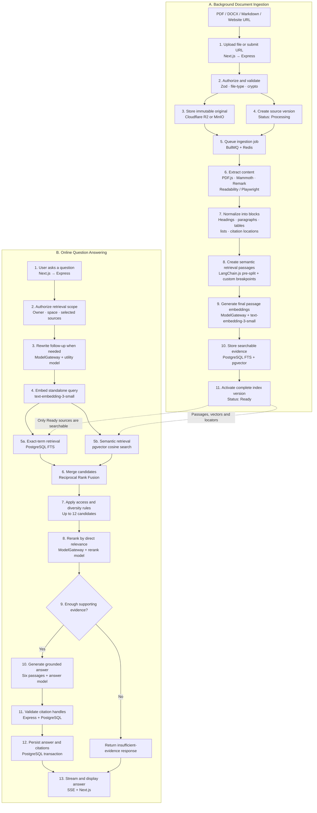

# Folio RAG — End-to-End Technical Flow

The RAG workflow contains two separate pipelines:

1. **Background ingestion** prepares a source once and makes it searchable.
2. **Online question answering** retrieves evidence from ready sources and generates a citation-grounded response.



The ingestion pipeline is asynchronous: uploading a source does not block the user interface while extraction and indexing run. The question-answering pipeline is synchronous and searches only active `Ready` source versions. If provider reranking fails or times out, the backend uses the top Reciprocal Rank Fusion results; if evidence remains insufficient, Folio does not generate an unsupported answer.

## A. Document Ingestion

| Step | Function | Tools/technology | Output |
|---:|---|---|---|
| 1 | User uploads PDF, DOCX, Markdown, or submits a URL | Next.js upload form, presigned upload URL | Uploaded object or submitted URL |
| 2 | Authenticate and verify space ownership | Express, application auth, PostgreSQL | Authorized request |
| 3 | Validate source type, size, signature, and checksum | Zod, `file-type`, Node.js `crypto` | Validated source |
| 4 | Store the original file or website snapshot | Cloudflare R2 or MinIO, `@aws-sdk/client-s3` | Private immutable storage object |
| 5 | Create source record with `Processing` status | PostgreSQL, `pg` | `source` and `source_version` records |
| 6 | Enqueue an idempotent ingestion job | BullMQ, Redis, `ioredis` | Background ingestion job |
| 7 | Extract source content | Format-specific tools below | Structured document content |
| 8 | Normalize content into common blocks | TypeScript, `jsdom`, `sanitize-html` | Headings, paragraphs, tables, lists and locators |
| 9 | Pre-split blocks and create semantic retrieval passages | `@langchain/textsplitters`, custom TypeScript semantic breakpoint layer, `p-limit` | Passage list with source locations |
| 10 | Generate passage embeddings | OpenAI-compatible `/v1/embeddings`, `text-embedding-3-small` | 1,536-dimension vectors |
| 11 | Build lexical and vector indexes | PostgreSQL FTS, `pgvector` | Searchable passages |
| 12 | Atomically activate the source version | PostgreSQL transaction | Source status becomes `Ready` |

### Extraction tools by source type

| Source | Extraction tools | Preserved citation location |
|---|---|---|
| PDF | `pdfjs-dist` | Page number, passage and optional coordinates |
| DOCX | `mammoth`, `jsdom` | Heading path, paragraph and table position |
| Markdown | `unified`, `remark-parse`, `remark-gfm` | Heading path and original line range |
| Static website | Node.js `fetch`, `jsdom`, `@mozilla/readability` | Website snapshot and paragraph |
| JavaScript website | Playwright fallback, then Readability | Rendered snapshot and paragraph |
| Manual text | Zod and custom text normalizer | Paragraph index |

Failed extraction changes the source to `Failed`. Failed or partially indexed sources are never available to retrieval.

### LangChain.js-assisted semantic chunking

Install the supported JavaScript text-splitting packages:

```bash
npm install @langchain/textsplitters @langchain/core
```

LangChain.js provides recursive, token, and Markdown-aware splitters, but its current JavaScript API does not provide a `SemanticChunker` equivalent to the Python implementation. Folio therefore uses LangChain.js for deterministic pre-splitting and owns the semantic breakpoint algorithm in a small TypeScript service.

```mermaid
flowchart LR
    C1["Normalized blocks<br/>text + heading path + locator"]
    C2{"Source structure"}
    C3A["Markdown pre-split<br/>MarkdownTextSplitter"]
    C3B["Paragraph pre-split<br/>RecursiveCharacterTextSplitter"]
    C4["Enforce token ceiling<br/>TokenTextSplitter"]
    C5["Embed adjacent units in batches<br/>ModelGateway.embedTexts"]
    C6["Calculate adjacent cosine distance<br/>1 − cosine similarity"]
    C7["Select semantic breakpoints<br/>dynamic percentile threshold"]
    C8["Merge units into passages<br/>target/max tokens + heading boundary"]
    C9["Restore citation metadata<br/>page, heading, line or paragraph"]
    C10["Generate final passage embeddings<br/>stored in pgvector"]

    C1 --> C2
    C2 -->|Markdown| C3A
    C2 -->|PDF, DOCX, website or text| C3B
    C3A --> C4
    C3B --> C4
    C4 --> C5 --> C6 --> C7 --> C8 --> C9 --> C10
```



| Stage | Implementation | Required behavior |
|---:|---|---|
| 1 | Receive normalized blocks | Keep each block's source version, heading path, page, line range, paragraph index and original ordering. |
| 2 | Structure-aware pre-split | Use `MarkdownTextSplitter` for Markdown. Use `RecursiveCharacterTextSplitter` for PDF, DOCX, website and manual text blocks. Do not merge across source versions. |
| 3 | Token safety split | Use `TokenTextSplitter` only when a pre-split unit exceeds the configured hard token limit. Never split solely by characters after the token limit is known. |
| 4 | Unit embeddings | Batch adjacent units through the existing `ModelGateway.embedTexts()` method. Use the same embedding model configured for final passage indexing. |
| 5 | Semantic distance | Calculate `1 - cosineSimilarity(currentEmbedding, nextEmbedding)` for every adjacent pair within the same section. A larger distance indicates a likely topic boundary. |
| 6 | Breakpoint selection | Create a boundary when the distance exceeds the configured percentile threshold, a heading changes, or adding the next unit would exceed the maximum passage size. |
| 7 | Passage assembly | Merge adjacent units until a semantic boundary or size constraint is reached. Add limited overlap only between passages from the same section. |
| 8 | Metadata projection | Set each passage locator from the first and last contributing blocks so citations remain resolvable to the original source. |
| 9 | Final indexing | Generate one new embedding for each assembled passage, then store its text, vector, token count, strategy version and locator in PostgreSQL. |

Recommended MVP starting values:

```text
CHUNK_PRE_SPLIT_TOKENS=160
CHUNK_TARGET_TOKENS=500
CHUNK_MAX_TOKENS=800
CHUNK_OVERLAP_TOKENS=80
CHUNK_BREAKPOINT_PERCENTILE=90
CHUNK_EMBED_BATCH_SIZE=64
CHUNK_STRATEGY_VERSION=langchain-semantic-v1
```

These values are initial operating defaults, not permanent retrieval rules. Tune them with a Folio evaluation set that measures answer correctness, citation precision, retrieval recall and ingestion cost. The token splitter's encoding must match the selected embedding model closely enough to enforce the model's actual input limit.

Semantic chunking makes an additional embedding pass over the smaller pre-split units before final passage embeddings are generated. This increases ingestion latency and embedding usage, but it does not affect online question latency. Intermediate unit embeddings are job-scoped and are not stored in `pgvector`; only final passage embeddings are indexed. The ingestion job retries provider failures using the normal model-gateway policy and must not activate the source version unless semantic passage creation and final indexing both complete.

## B. User Question and Answer

| Step | Function | Tools/technology | Output |
|---:|---|---|---|
| 13 | User submits a question | Next.js, Express API | Question request |
| 14 | Authorize retrieval scope | Express, PostgreSQL | Allowed space and source IDs |
| 15 | Rewrite a context-dependent follow-up question | OpenAI-compatible Model Gateway, configured utility model, Zod schema | Standalone search query |
| 16 | Generate the query embedding | OpenAI-compatible `/v1/embeddings`, `text-embedding-3-small` | Query vector |
| 17 | Run exact-term search | PostgreSQL full-text search | Up to 30 lexical candidates |
| 18 | Run semantic search | `pgvector` cosine search | Up to 30 vector candidates |
| 19 | Merge both search results | Custom Reciprocal Rank Fusion | Broad ordered candidate list |
| 20 | Apply ownership and source-diversity filters | Express retrieval service | Up to 12 authorized candidates |
| 21 | Rerank candidates by direct relevance | OpenAI-compatible Model Gateway, configured rerank model, structured JSON | Final six evidence passages |
| 22 | Generate an evidence-grounded answer | OpenAI-compatible Model Gateway, configured answer model | Answer blocks with evidence handles |
| 23 | Validate citations | Express, Zod, PostgreSQL | Verified passage and source locations |
| 24 | Persist the answer and citations | PostgreSQL transaction | Conversation message and citations |
| 25 | Stream and display the result | Server-Sent Events, Next.js, React | Answer with clickable citations |

## C. OpenAI-Compatible Model Gateway

`ModelGateway` is the only application component that communicates with the cloud model provider. Domain services depend on task-specific interfaces instead of provider SDK response types:

```ts
interface ModelGateway {
  rewriteQuestion(input: RewriteQuestionInput): Promise<StandaloneQuestion>;
  embedTexts(input: string[]): Promise<number[][]>;
  rerankPassages(input: RerankInput): Promise<RankedPassageIds>;
  streamGroundedAnswer(input: GroundedAnswerInput): AsyncIterable<AnswerEvent>;
}
```

Use the official `openai` Node.js SDK with a configurable API key, base URL, and model IDs. The default compatibility contract uses:

- `/v1/chat/completions` for question rewriting, reranking, and grounded-answer generation;
- `/v1/embeddings` for document and query embeddings;
- Server-Sent Events for streamed chat output;
- JSON Schema when supported by the selected provider, followed by mandatory Zod validation;
- prompt-constrained JSON plus Zod validation when the provider does not implement JSON Schema.

The Responses API may be enabled when using OpenAI directly, but RAG domain services must continue calling the same `ModelGateway` interfaces. This prevents provider-specific response formats from leaking into retrieval, citation, or conversation code.

### Free cloud chat provider profiles

Select exactly one chat provider profile per environment. The application uses logical model roles—utility, rerank, and answer—so no domain service depends on a specific provider or model ID.

| Profile | OpenAI-compatible base URL | Utility and rerank model | Answer model | Recommended use |
|---|---|---|---|---|
| **Groq Free** | `https://api.groq.com/openai/v1` | `openai/gpt-oss-20b` | `openai/gpt-oss-120b` | MVP development and a small private pilot |
| **Google Gemini Free** | `https://generativelanguage.googleapis.com/v1beta/openai/` | `gemini-3.6-flash` | `gemini-3.6-flash` | Development with public or non-sensitive test content only |
| **Cloudflare Workers AI Free** | `https://api.cloudflare.com/client/v4/accounts/<ACCOUNT_ID>/ai/v1` | `@cf/openai/gpt-oss-20b` | `@cf/openai/gpt-oss-120b` | Alternative when Folio already uses Cloudflare R2 or Workers |
| **OpenRouter Free** | `https://openrouter.ai/api/v1` | `openrouter/free` | `openrouter/free` | UI demos and experiments only |

These profiles are alternatives, not a provider chain. Folio should not silently send a request to another provider when a free quota is exhausted. Provider changes must be explicit environment configuration because privacy terms, output behavior, limits, and model availability differ.

Groq is the free profile, it exposes fixed model IDs through an OpenAI-compatible API. Gemini Free must not receive confidential Folio sources: Google states that free-tier content may be used to improve its products and may be reviewed by people. Cloudflare is a practical alternative when the team already uses its platform. OpenRouter's free router may select different free models over time, so it is unsuitable for repeatable reranking, citation behavior, or production service levels.

Current free-tier limits and model availability must be rechecked before deployment:

- [Groq OpenAI compatibility](https://console.groq.com/docs/openai), [models](https://console.groq.com/docs/models), [rate limits](https://console.groq.com/docs/rate-limits), and [data controls](https://console.groq.com/docs/your-data)
- [Google Gemini OpenAI compatibility](https://ai.google.dev/gemini-api/docs/openai), [pricing](https://ai.google.dev/gemini-api/docs/pricing), and [terms](https://ai.google.dev/gemini-api/terms)
- [Cloudflare OpenAI compatibility](https://developers.cloudflare.com/workers-ai/configuration/open-ai-compatibility/) and [pricing](https://developers.cloudflare.com/workers-ai/platform/pricing/)
- [OpenRouter free models](https://openrouter.ai/docs/faq) and [free model router](https://openrouter.ai/docs/cookbook/get-started/free-models-router-playground)

The document and query embedding configuration is independent of the selected chat profile. Both operations must always use the same embedding model and dimensions. Changing the embedding model requires a new index version and full re-embedding.

### Backend configuration

Configure one of the following chat profiles.

**Option A — Groq Free**

```text
MODEL_PROFILE=groq-free
MODEL_API_BASE_URL=https://api.groq.com/openai/v1
MODEL_API_KEY=<groq-api-key>
MODEL_UTILITY_MODEL=openai/gpt-oss-20b
MODEL_RERANK_MODEL=openai/gpt-oss-20b
MODEL_ANSWER_MODEL=openai/gpt-oss-120b
```

**Option B — Google Gemini Free**

```text
MODEL_PROFILE=gemini-free
MODEL_API_BASE_URL=https://generativelanguage.googleapis.com/v1beta/openai/
MODEL_API_KEY=<gemini-api-key>
MODEL_UTILITY_MODEL=gemini-3.6-flash
MODEL_RERANK_MODEL=gemini-3.6-flash
MODEL_ANSWER_MODEL=gemini-3.6-flash
```

**Option C — Cloudflare Workers AI Free**

```text
MODEL_PROFILE=cloudflare-workers-ai-free
MODEL_API_BASE_URL=https://api.cloudflare.com/client/v4/accounts/<ACCOUNT_ID>/ai/v1
MODEL_API_KEY=<cloudflare-api-token>
MODEL_UTILITY_MODEL=@cf/openai/gpt-oss-20b
MODEL_RERANK_MODEL=@cf/openai/gpt-oss-20b
MODEL_ANSWER_MODEL=@cf/openai/gpt-oss-120b
```

**Option D — OpenRouter Free (demo only)**

```text
MODEL_PROFILE=openrouter-free
MODEL_API_BASE_URL=https://openrouter.ai/api/v1
MODEL_API_KEY=<openrouter-api-key>
MODEL_UTILITY_MODEL=openrouter/free
MODEL_RERANK_MODEL=openrouter/free
MODEL_ANSWER_MODEL=openrouter/free
```

The remaining settings are shared by all profiles:

```text
MODEL_API_PROTOCOL=chat-completions

MODEL_EMBEDDING_BASE_URL=https://api.openai.com/v1
MODEL_EMBEDDING_API_KEY=<embedding-api-key>
MODEL_EMBEDDING_MODEL=text-embedding-3-small
MODEL_EMBEDDING_DIMENSIONS=1536

MODEL_REQUEST_TIMEOUT_MS=60000
MODEL_RERANK_TIMEOUT_MS=30000
MODEL_MAX_RETRIES=1
```

The API key must exist only in backend secret storage. It must never be included in Next.js browser bundles, application logs, model prompts, or persisted answer metadata.

## D. Retrieval and Answer Rules

- Only sources in `Ready` state can be searched.
- Retrieval is restricted by `owner_id`, `space_id`, and selected source scope.
- Notes are excluded unless explicitly converted into sources.
- The model receives only the final selected passages.
- The model cannot create real passage IDs or page numbers.
- Express resolves temporary evidence handles to stored citation locations.
- If reranking fails, use the top Reciprocal Rank Fusion results.
- If supporting evidence is insufficient, return an insufficient-evidence response instead of answering from model knowledge.

## E. Primary Technology List

```text
Frontend:             Next.js, TypeScript
Backend:              ExpressJS, TypeScript, Zod
Background jobs:      BullMQ, Redis
Database:             PostgreSQL, pgvector, PostgreSQL FTS
Object storage:       Cloudflare R2 or MinIO
Model gateway:        OpenAI-compatible API using the openai Node.js SDK
Chat provider:        Groq Free (default), Gemini Free, Cloudflare Workers AI Free,
                      or OpenRouter Free (demo only)
Utility/rerank model: Selected provider profile model
Answer model:         Selected provider profile model
Embedding model:      text-embedding-3-small, configured independently
Chunking:             @langchain/textsplitters + custom TypeScript semantic breakpoints
PDF extraction:       pdfjs-dist
DOCX extraction:      mammoth
Markdown extraction: unified + remark
Website extraction:  Readability + jsdom + Playwright
Streaming:            Server-Sent Events
```
